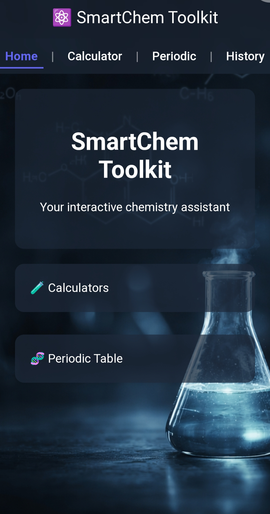

# ⚛️ SmartChem Toolkit

SmartChem Toolkit is a web-based application designed to help students solve and understand chemistry problems through interactive tools and step-by-step explanations.

---

## 🚀 Features

### 🧪 Chemistry Calculators
- Molarity Calculator  
- pH Calculator  
- Dilution Calculator  
- Gas Law Calculator (PV = nRT)  

### 🧠 Step-by-Step Explanations
- Toggle to view detailed calculation steps  
- Helps users understand formulas instead of just getting answers  

### 🧬 Periodic Table Lookup
- Search for elements by name  
- Displays:
  - Symbol  
  - Atomic Number  
  - Atomic Mass  

### 📜 History Tracking
- Saves previous calculations using local storage  
- Option to clear history  

### 🏠 User Interface
- Clean and modern glass-style UI  
- Easy navigation between sections (Home, Calculators, Periodic Table, History)  

---

## 🛠️ Tech Stack

- HTML5  
- CSS3  
- JavaScript (Vanilla JS)  
- LocalStorage  

---

## 🎯 Purpose

The goal of SmartChem Toolkit is to make chemistry easier and more interactive for students. Instead of only providing answers, the application explains the steps behind each calculation, helping users build a deeper understanding of key concepts.

---

## 💡 Future Improvements

- Full interactive periodic table grid  
- Additional calculators (molar mass, equilibrium, etc.)  
- Convert to a Progressive Web App (PWA)  
- Improved animations and UI transitions  

---

## 📸 Preview

### 🏠 Home

### 🧪 Calculators

### 🧬 Periodic Table

### 📜 History

---

## 🌐 Live Demo

_Add your deployed link here_

---

## 👤 Author

Built by **Aishat Ize (Ayoosh-Tech)** 

---

## ⭐ Support

If you find this project useful, feel free to star the repository and share it!
